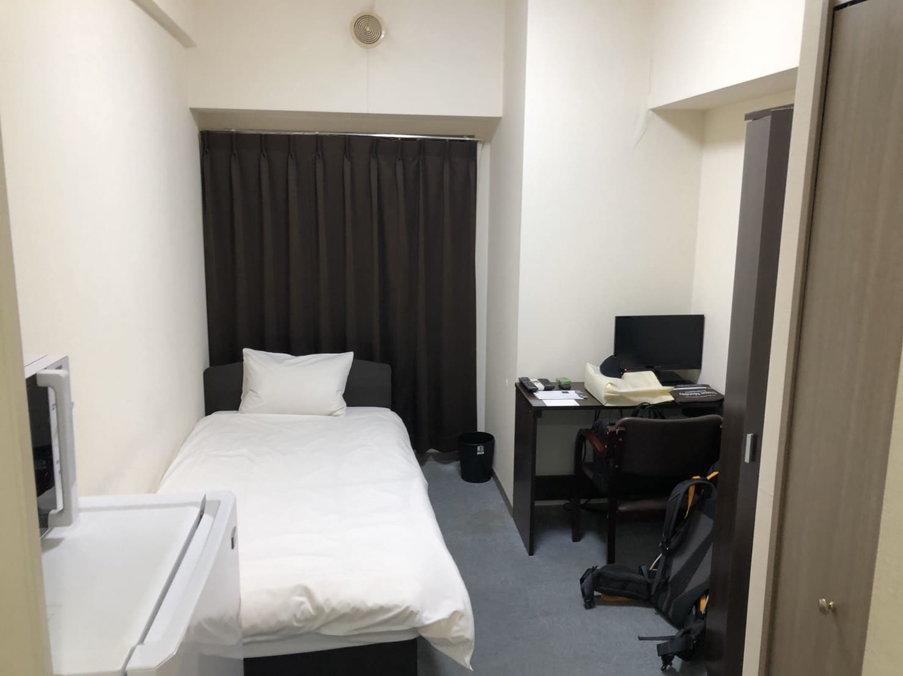
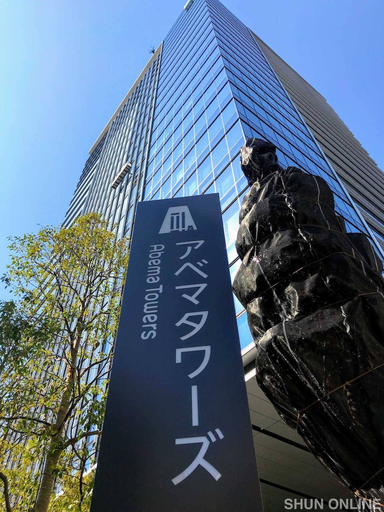
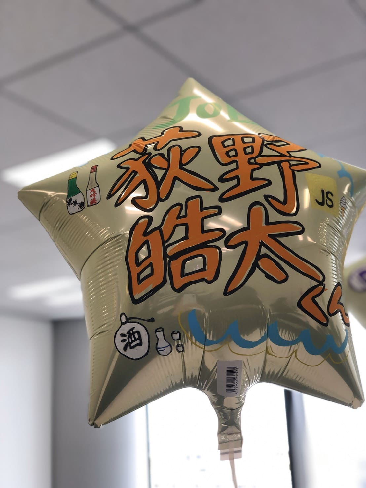

今回の記事では僕が2020年3月5日〜3月26日まで行っていたCA Tech JOBについての概要と実施に至るまでの経緯や初日の出来事などを書いていきます。  
インターンでの具体的な業務内容は（後篇）の記事に詳しくまとめる予定です。

## CA Tech JOBとは

CA Tech JOBとは株式会社サイバーエージェントで行われている長期就業型インターンで、フロントエンドやバックエンド、インフラなどの分野に分かれて、トレーナーの社員さんのもと実務を経験するというものです。

### インターン決定に至るまで

サイバーエージェントの採用ページからエントリーして、ESを提出するところから始まります。それ以降の面接は個人差があるらしいですが僕の場合は１次面接に人事面接、２次面接に技術面接がありました。  
人事面接ではこのインターンを通してやりたいことや、実際にどこの部署でインターンを行いたいのか等の質問がされました。僕は過去のCAのインターンで株式会社CAMというファンビジネスを中心に行っている子会社で働いている方がメンターだったこともあり、就業希望部署はCAMで出していました。また、その時のインターンがフロントエンド関連のものだったので今回のインターンもそのままフロントエンドエンジニアとして希望を出しました。  
技術面接の際は実際に今自分がどの程度コードを書けるのか、使える技術は何なのか等の自分の実力面について多く聞かれている印象を受けました。また、自分がインターンでやりたいことは技術面接でも改めて聞かれました。その他にもCAMの中にも部署が複数あるが興味がある部署はあるかという質問を受けた記憶があります。  
人によっては３次面接もあるらしいですが、僕は2次面接が終わった段階でインターンの内定通知をいただきました。

## インターンを迎えるまでの間

インターン内定後、数週間ほどして正式に勤務部署等の情報が決定します。その後、交通費請求の手続きの案内や、僕のように遠方からくる学生の場合はマンスリーマンションの手続きの案内が届きました。また、入社式の時に使う自己紹介スライドも提出しました。自分の得意言語や趣味などザ・自己紹介的な感じでした。  
事務的な手続き等は複数あるものの技術的な課題は特別あるわけでもなく、プログラミング学習は個人で行っていました。使用する具体的な技術等をこの時点で教えてもらっていたら、インターンが始まってからスムーズに業務に取りかかれたかもしれないと今振り返ってみて思います。  
東京のマンションにはインターン開始日の前日から入居することができたので、東京に前日入りして荷解きをしたり生活の準備をしたりして、万全の状態でインターンに臨む準備をすることができました。

上の写真が実際に僕が約１ヶ月滞在した部屋です。一人暮らしをする分には申し分ない広さです。僕は使わなかったのですがテレビもあるので暇つぶしの道具もあります。ただ、WifiがポケットWifiの支給となっており使用可能容量が７GB/月だったので家でパソコンをいじることは基本的にせずに作業はカフェ等でするようにしていました。

## インターン初日

インターン初日は入社式となっており本社であるAbemaTowersに集まって契約書の記入といった事務的な手続きから自己紹介といったアイスブレイク的なことを行いました。ここでMacbookの支給もあり、僕はこの時初めて最高スペック（多分）のMacbook触れました。  
インターンと全く関係ないんですけどAbematowersってどうして複数形なんでしょうか？見た感じタワーが複数あるわけでもなさそうですし…。

入社式の時に人事の方からこのようなバルーンのプレゼントが有りました。バルーンに書かれている僕の本名は気にしないでください（笑）このブログ上ではオキツと名乗っているので…。  
話がそれてしまいましたが、事前に提出していた自己紹介パワポの内容をもとに自分の得意言語のロゴや趣味のイラストをこのバルーンに描いてくださっていました。僕のバルーンにはしっかりとjavascriptのロゴと共にバニラアイスの絵が添えられていました。また、日本酒の絵も描かれており後日この絵をきっかけに飲み会に誘っていただく事になりました（笑）

### 配属部署での顔合わせ

私が配属になった部署は中目黒にオフィスを構えており、Abematowers勤務の同期の人達と一生の別れをした後にタクシーで中目黒オフィスに移動しました。中目黒オフィスに着いたら早速、私が所属するフロントエンドエンジニアのチームで焼肉ランチに行くことになりました。これからお世話になる方々と話しつつ、美味しいお肉を奢ってもらえて最高の滑り出しでした。  
その日の残りは環境構築であったり、これからのインターンでやる予定の業務の打ち合わせなどを行いました。技術的な課題も行ったりしたのですが詳しくは[後篇の記事](https://okitsublog.com/2020/04/ca-tech-job-2/)に書いていきたいと思います。
