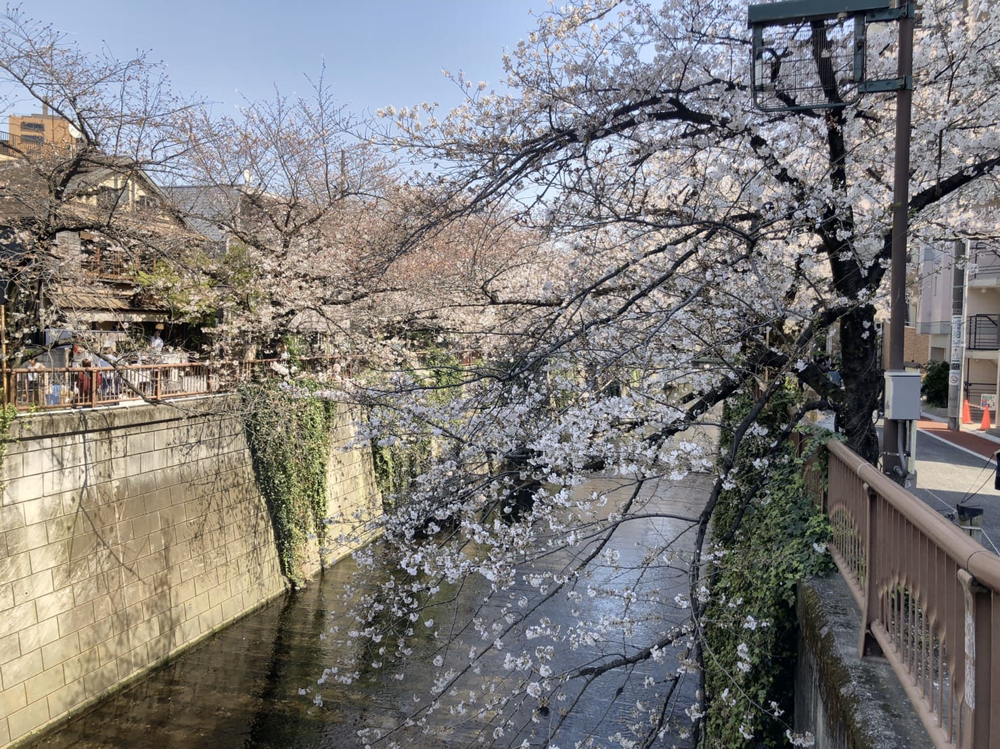
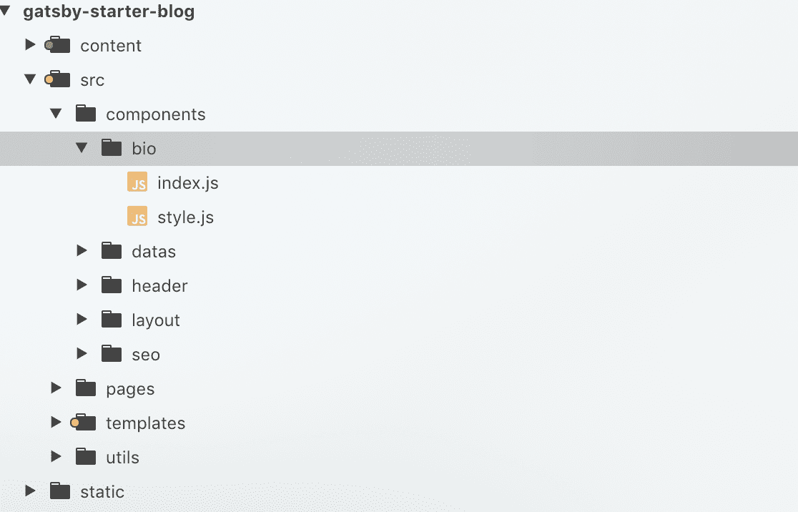
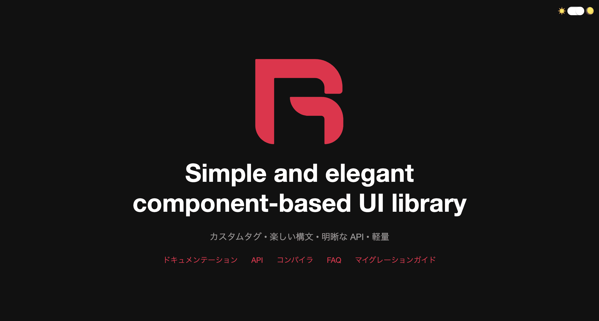

前回の記事、[CA Tech JOB に参加してみて in サイバーエージェント(後篇)](https://okitsublog.com/2020/04/CA%20Tech%20JOB%20%E3%81%AB%E5%8F%82%E5%8A%A0%E3%81%97%E3%81%A6%E3%81%BF%E3%81%A6%C2%A0in%20CyberAgent/)の続きになります。まだ前篇の記事を見ていないという方は是非ご一読ください！

##株式会社CAM

僕は[株式会社CAM](https://www.cam-inc.co.jp/)（以下CAM）というサイバーエージェント（以下CA）の子会社に配属になりました。ファンビジネスや占い事業などの事業を展開しています。その中で、ファンビジネスの所属になりました。ファンビジネスでは有名アイドルグループのサービスサイトを作るなどファンの方々に向けたサービスを作っていました。  
CAMの中でもファンビジネスの部署は大人の都合でオフィスが中目黒にあるため、CAの本社であるAbematowersから徒歩5分の好立地にあるマンションから徒歩20分強かけて出社していたのも今となっては良い思い出です（笑）あと、目黒川がとても近かったので毎朝桜を見ながら出勤できたのは中目黒オフィス勤務の特権だと思っています！



目黒川の桜は多くの人が訪れる観光スポットになっているだけあってとても綺麗でした！

##インターン中に行ったこと

###環境構築

まずは環境構築です。Githubのリポジトリの閲覧権限をもらって自分のMacbookに開発環境を…といきたかったのですが、ここで権限の壁にぶち当たりました。近くの社員さんが管理者権限を持っていて僕に閲覧権限を付与してもらえる間はまだ良かったのですが、Dockerのリポジトリの管理者権限を持った人がオフィスにいない…という事態に陥ってしまい人事の方に確認。結果としてインターン生用の全リポジトリの閲覧権限が与えられるチームに入れてもらうことができました。最初からこのチームに入っておけば環境構築は1時間近くで終わったと思うのですが、僕の場合は2日間かかってしまいました。  
大規模プロジェクトの開発に携わるのは初めてだったので、まさかこんなにもリポジトリ権限の管理が厳しいものだとは思ってもいませんでした。しかし、ファンビジネスは特にクライエント様がいて成り立っているので安全や信頼面でもセキュリティはしっかりするに越したことはないことを学ぶ事ができたので結果オーライだと思ってます（笑）。

###フロント改修

インターン中の実務として、ある動画配信サービスとその管理画面のUIの改修を行っていました。まず最初に管理画面を実際に自分で使ってみて、改善したほうが良いと思われる箇所をまとめてディレクターの方に提案をしました。ディレクターさんへの提案の仕方や、業務を進めていく上での時間の意識の仕方などマインド面などで多くのことを学ぶことができました。その後自分で提案した改善箇所を訂正し、プルリクエストをマスターに上げるところまで行うことができました。始めて自分のプルリクエストがマージされた時は不思議な感じがしたのを今でも覚えています。（ああ、本当に実務をしてたのか…）と感じて、自分がやることに対して一定の責任があることを実感しました。  
管理画面の改修を一通り終えた後は実際のサービス画面のフロント改修を行いました。オキツのプログラミング人生の中で最大の大規模サービスへのアサインだったので最初の頃は延々と様々なフォルダを行ったり来たりしていました。（笑）  
WebComponentを用いた開発を行っており、後から開発に参加した人でもどこのファイルを修正すれば何を修正できるのかがわかりやすくなっていたため、WebComponentを使うことでサービスの保守性が上がるのだということを実感しました。また、ボタンやモーダルなどの共通部分をコンポーネント化することで使い回しがきくようになっていたので開発の際は大分助けられました。



この画像に写っているツリーはこのブログのものです。このようにある機能を修正する時に、どこのファイルを修正すれば良いのか一目瞭然なので複数人数での開発での保守性であったりコンポーネントの再利用など効率的に開発を進めることができます。

###フロントエンドハッカソン

CAMのフロントエンドチームの中で技術力を高め合うために毎週課題が出され、課題に応じたコードを提出していました。実際にあった課題の例として  

-**レイアウト模写**  
-**インフィニティスクロール**  
-**カード入力フォーム**  

などがありました。色々と調べて実装してみても、先輩エンジニアの方々は自分とは全く違った方法で実装していたりしたので非常に勉強になりました。自分はこういう風に書いたけど実際はもっと上手い書き方がある事を知ると驚くくらいに自分の中で理解を深めることができました。
また、課題によっては**ピュアなJavaScriptのみでの実装**という条件がついていて、ライブラリやフレームワークに頼らないJavaScriptの自力を高めるという風潮に刺激を受けました。

##実務で使用した技術

###Riot.js



実際の業務では[Riot.js](https://riot.js.org/ja/)を使用していました。Reactと比べられることが多いライブラリで、Reactと比べて非常に軽量であることが強みにあげられています。また、**必要最低限の機能**をうたっており学習コストが低いことも強みの一つです。  
最初にRiotを使っていると告げられた時は（Reactじゃないの？！）と思い「Reactじゃないんですね」と正直にトレーナーの方に思ったことを伝えました（笑）  
トレーナーの方曰く、開発が始まった当時にRitoに強いエンジニアの方がいた点やReactを使うほどの大規模プロジェクトでは無いと想定されたためRitoを選定したとのことでした。  
しかし、Ritoに関しての情報量はReactと比べるとどうしても少ないという点やRiotの最新バージョンに追いつけていない点から、Riotを次のプロジェクトで採用するかは微妙という話もしていました（笑）

###BEM

コーディングの命名規則としてBEMという手法を用いていました。BEMとは  

-**B**block（一番大きい括り）  
-**E**lemen（その括りの中にいる要素）  
-**M**odifire（その要素の中での変化球的存在）  

の略です。具体的なコードで見てみると  

```html
<div class="block">
  <h1 class="block__title">
    オキツのブログ
    <p class="block__title-sub">ミーハーを地で行く系男子大学生の備忘録</p>
  </h1>
  <p class="block__content">今日の天気はイヌ時々ネコ！</p>
</div>
```

という風になっていきます。命名規則を決めることによりクラス命名が楽になるとともに、要素の持つ役割がひと目で分かるようになっています。  
また、CSSを書く際にSassを用いることで下記のように簡略化してコードを書くことが可能になります。  

```SCSS
.block {
  margin: 0 auto;
  &__title {
    color: red;
  }
  &__title-sub {
    color: blue;
  }
  &__content {
    color: yellow;
  }
}
```

しかし、Sassを使用するとフォルダ内でクラス名を検索する時に上手くいかなくなるいうデメリットもあるので、チーム内でSassを使うか否かを事前に決めておく必要があるということを先輩エンジニアの方がおっしゃっていました。  
BEMを実際に用いることで、チーム開発における命名規則の徹底は自分のコードを他人が見ても分かりやすくなるとともにコードの書き方をある程度統一することができることが分かりました。

##まとめ

大規模プロジェクトのへのアサインという初体験を通して改めて**綺麗なコードを書く大切さ**に気付かされました。また、フロントエンドの新しいライブラリやフレームワークを使う上で大切なことは**いかにピュアなJavaScriptについて理解できるか**が鍵になってくることを、Riot.jsという自分自身にとって全く新しい技術を使う機会を得て感じました。他にもエンジニアとしてのマインドや多職種の方との連携など、独学でコードを書いているだけでは学ぶことができないことを経験できたので今後の自分の働き方に関して意識する機会にもなりました。  
最後に、今回のインターンの調整を色々としてくださった人事の皆様、未熟者の僕に丁寧にサポートしてくださったトレーナーの方をはじめとした先輩エンジニアの皆様、**…長いあいだ‼‼くそお世話になりました‼‼**  


