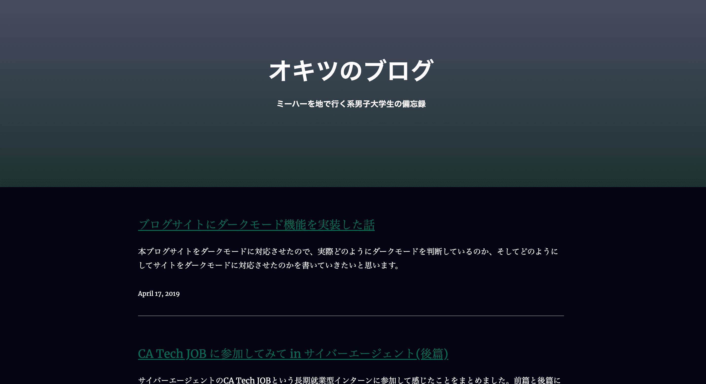

先日、本ブログサイトをダークモードに対応させたので、実際サイトがどのようにダークモードを判断しているのか、そしてどのようにしてサイトをダークモードに対応させたのかを書いていきたいと思います!

## ダークモードとは？


上のGifを見てもらうと、よく分かると思いますがダークモードとは暗い場所でサイトを閲覧しやすくするために、サイトの色合いを暗くすることです。  
自身のスマホやPCからダークモードに関する設定はできるため、サイト側がその設定を読み取ることでダークモードを設定しているユーザーにとって心地良いUI（ユーザーインターフェイス）にすることができます。


これは今まで通りの僕のブログです。明るい場所で読む分には良いのですが暗い場所では「眩しいぃ！」ってなりますよね。  
そのために存在するのがダークモードで普段からサイトの色味を抑えることで目に優しいネットサーフィンライフを送る事ができます（笑）  
また、一説によるとダークモードにすると充電の減りが遅くなるらしいです。ソースは不明ですが、僕はなんとなくダークモードの方が節電してそうだなって思います（小並感）。



このようにサイトをダークモードにすると~~かっこよくて~~、目に優しい気がしますよね！はい、僕はそんな気がします。  
ダークモードをサイトに採用すると~~UIがかっこよくなるし~~、スマホやPCでダークモード設定しているユーザーにとって優しいサイトにすることができますね！

##ダークモードの実装方法

ダークモードを利用する方法はいたって簡単です。以下のようにメディクエリを用いることでPCやスマホがダークモードか否かを判断できるので、CSSに  

```@media (prefers-color-scheme: dark)```  

と記入するだけでダークモードを実装することができます！  


```CSS
@media (prefers-color-scheme: dark) {
  .isHome {
    color :#ffefff;
  }
}
```

実際にこのブログでダークモードのために記述しているのは本当にこれだけなんです。とりあえずダークモードを実装したい！という人はCSSをちょっと触るだけでダークモードが出来上がるのでオススメです！  

###ダークモードをサイト内で切り替えたい###

僕の次の目標はサイト内でダークモードとライトモードの切り替えを行えられるようにすることです。


上から2,3行目に注目してすると  

```media:"prefers-color-scheme: dark"```  

```matches:"true"```  

となっているのがわかるかと思います。これを用いることで```matches```が```true```の時は最初からダークモードに設定を行い、それ以降は切り替えボタンを押すごとにtrueとfalseを切り替えていけばサイト内でダークモードの切り替えが行えられるという算段で考えています。  
こんな感じで自分のブログサイトを少しずつ技術の勉強も兼ねて豪華にしていきたいですねぇ。。。
