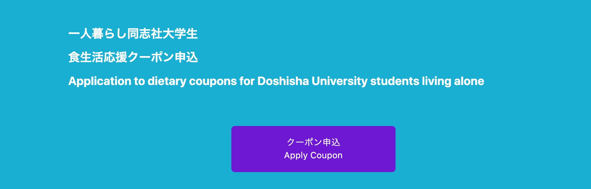
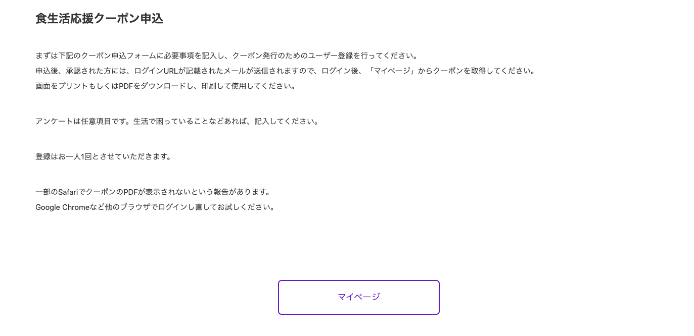
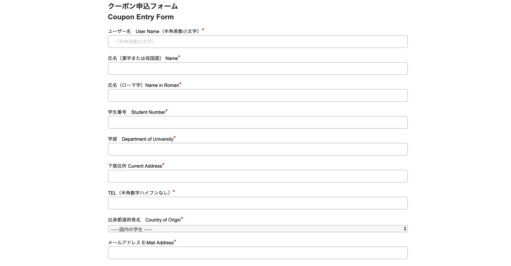
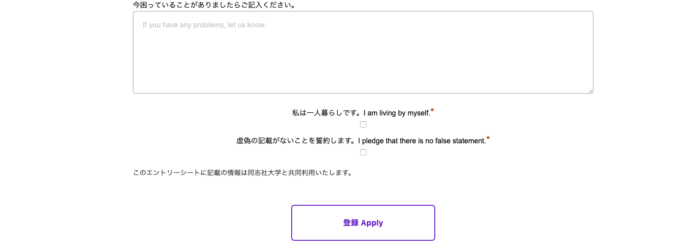
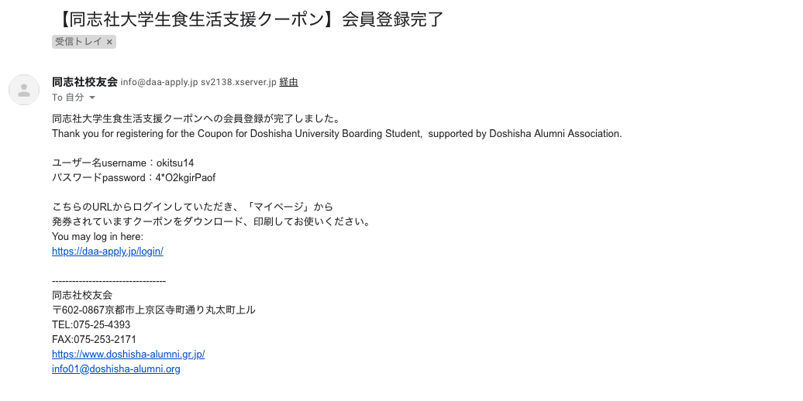
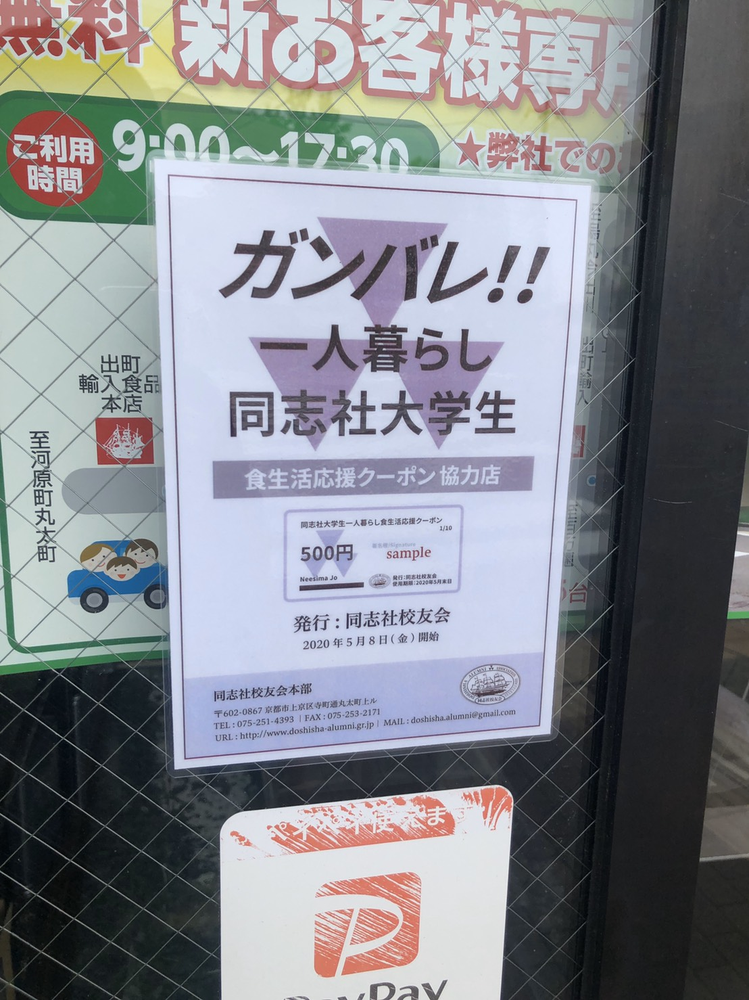
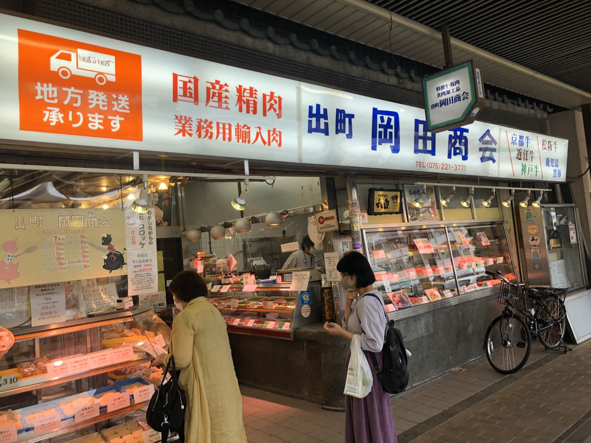
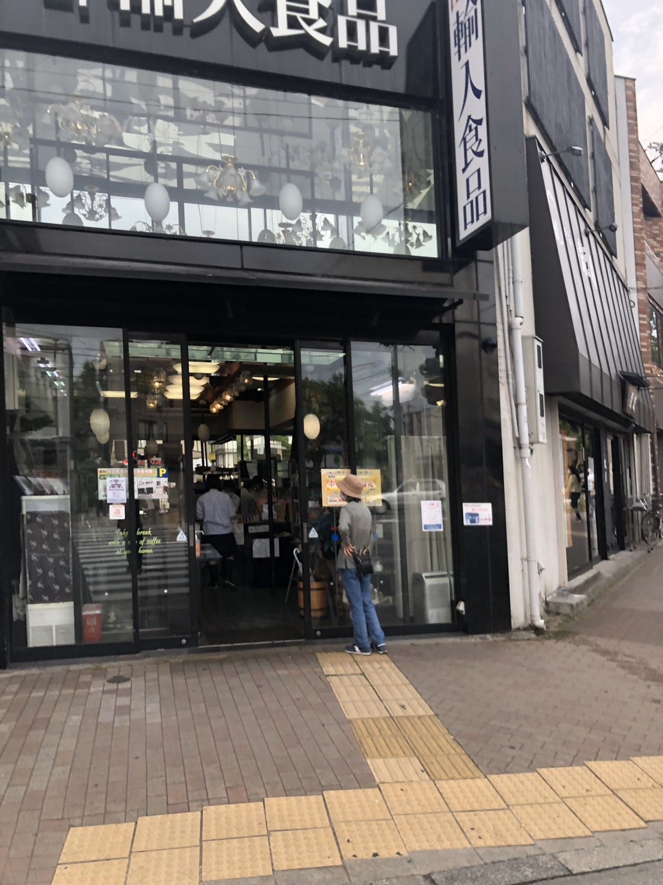

##ガンバレ！！一人暮らし同志社大学生

5月8日より、同志社大学の卒業生で構成されている同志社校友会が、一人暮らし学生の支援として計5000円の金券の配布をオンラインで開始している。  
現在の社会情勢を加味して、金券の申込みから取得まで全てオンラインで可能なので、本記事ではその方法と一部利用可能店舗について解説していこうと思う。  
大学のHPで特設サイトが用意されているので先に詳しく知りたい方は[こちら](https://www.doshisha.ac.jp/news/2020/0511/news-detail-7613.html)から確認していただきたい。  
また、クーポンは5月末日までしか利用できないので、この記事を読んでいただいている方は今すぐにでも申し込みすることを推奨する。

##利用方法

まず[同志社大学生食生活支援申し込みサイト](https://daa-apply.jp/)にいき,ページを下にスクロールしていくと**クーポン申し込み**というボタンがあるのでそれを押す。  

その後、クーポン申し込みページに飛ぶので、**マイページ**ボタンを押す。

そうすると、マイページ作成画面に飛ぶ。ここで必要な情報を記入する。学籍番号や下宿先など一、人暮らしの同志社学生を証明する必要があるので、下宿先の住所も必要になってくる。また、登録後に確認のメールが来るので、しっかりとメールが届くアドレスを入力していただきたい。  

必要情報を入力後、**登録**を押すと以下の様なメールが届くので、メールに記載されているURLを押す。  

URLを押すと、今度こそマイページに行くことができるので、そこからクーポンのPDFをダウンロードできる。

クーポンには自分の学生番号と固有のIDが記載されているので、不正利用を考えている方はやめておいたほうがいいだろう。クーポン利用時に学生証の提示が求められるのだ。

##クーポン利用可能店舗

基本的にクーポン利用可能店舗は[こちら](https://daa-apply.jp/shop/)から確認することができるのだが…どうにも詳細にかける。千本商店街の店や出町商店街振興組合など、ざっくりと記述されている箇所もある。  
私自身は出町商店街をよく利用するので、ここの詳細が知りたいところである。ということで私が独自に調べた出町商店街の店舗を紹介していこうと思う。  
ちなみに、このクーポンを利用可能な店舗には

このようなチラシが掲示されているので、ご自身で利用可能店舗を開拓する際の目印にしていただきたい。  

###利用可能店舗＠出町商店街

ここからは、私自身が出町柳を練り歩いて見つけたクーポン利用可能店舗を紹介していく。

####岡田商会

まず初めに紹介するのが、河原町今出川交差点の近くに位置している**岡田商店**である。岡田商会は精肉屋であるため、肉を喰らいたい気分だけど、アルバイトもできなくて収入が安定しなくて肉を喰らう余裕がない…という方はぜひクーポンを握りしめて、岡田商会に足を運んでみてはいかがだろうか。  
また、揚げ物も販売しており、その場で揚げてもらうことも可能なため小腹が空いた時にもおすすめしたい。  

岡田商会の情報は[こちら](https://tabelog.com/kyoto/A2601/A260302/26016090/)

####えびす屋

えびす屋は出町商店街にある言わずと知れたスーパーである。ここでもクーポンが利用できるため、普段の買い物でもクーポンを利用できるのはありがたい限りである（主観）。  
えびす屋の情報は[こちら](http://masugata.demachi.jp/contents/tenpo/higasi/ebisu/ebisu.html)

####出町輸入食品

出町輸入食品は河原町今出川交差点を少し南にいった場所に位置している。コーヒー豆をメインに販売している店なので、コーヒーを自分で淹れている方にはオススメである。  
コーヒー以外にも海外のお菓子も販売しているので、嗜好品目当てに訪れるのも一つの手ではないだろうか。  
出町輸入食品の情報は[こちら](http://demachi.com/)

##おわりに

本記事では一人暮らしの同志社学生が利用できる5000円のクーポンの利用方法、利用可能店舗について紹介した。  
現在、一人暮らししている同志社学生の方はぜひ利用してみてはいかがだろうか。